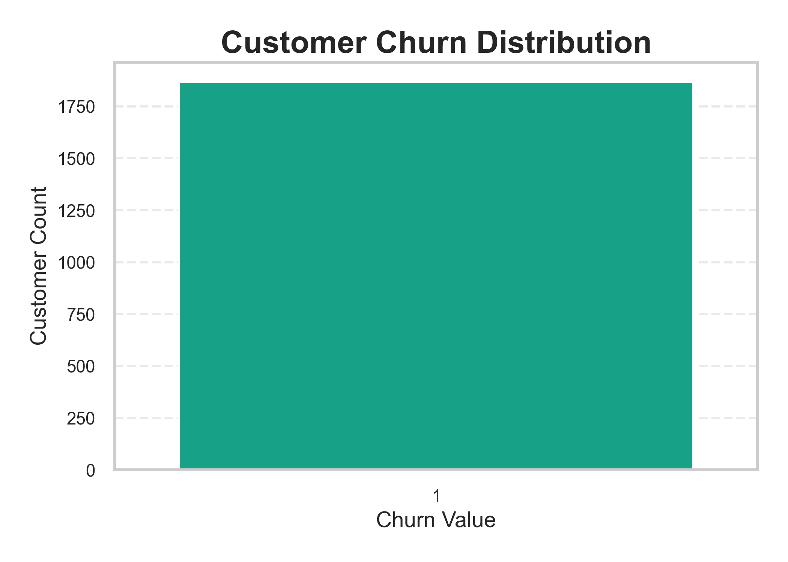
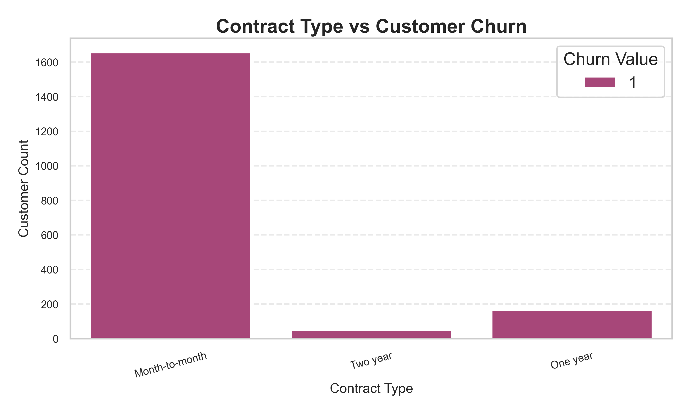

# Customer Churn Prediction Project

## Project Overview

This project focuses on predicting customer churn using machine learning techniques. The objective of the project is to analyze customer behavior and identify factors that influence customer churn in a telecom company.

The project includes data cleaning, exploratory data analysis, feature engineering, machine learning model building, and visualization of important business insights.

---

## Tools & Technologies Used

* Python
* Pandas
* NumPy
* Matplotlib
* Seaborn
* Scikit-learn
* Machine Learning
* Git & GitHub

---

## Dataset Information

The dataset contains telecom customer information such as:

* Customer demographics
* Contract type
* Monthly charges
* Tenure
* Internet services
* Payment methods
* Churn status

---

## Project Workflow

1. Data Cleaning
2. Handling Missing Values
3. Exploratory Data Analysis
4. Feature Engineering
5. Data Visualization
6. Logistic Regression Model
7. Random Forest Model
8. Feature Importance Analysis
9. Correlation Heatmap

---

## Machine Learning Models Used

### Logistic Regression

Used as a baseline classification model for customer churn prediction.

### Random Forest Classifier

Used to improve prediction performance and analyze feature importance.

---

## Key Insights

* Customers with month-to-month contracts had higher churn rates.
* Higher monthly charges were associated with increased churn probability.
* Contract type and tenure were among the most important factors affecting churn.

---

## Project Visualizations

### Customer Churn Distribution

---

### Contract Type vs Churn

---

### Feature Importance Analysis

---

## Project Structure

Customer_Churn_Prediction/
│
├── outputs/
├── clean_churn_data.csv
├── Project.py
├── README.md
└── churn.xlsx

---

## Author

Satyam 
